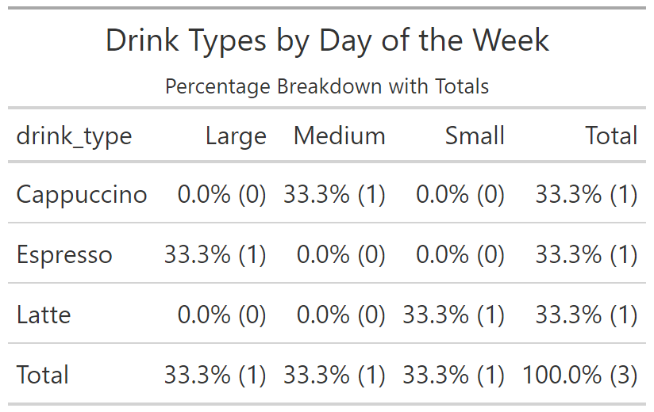
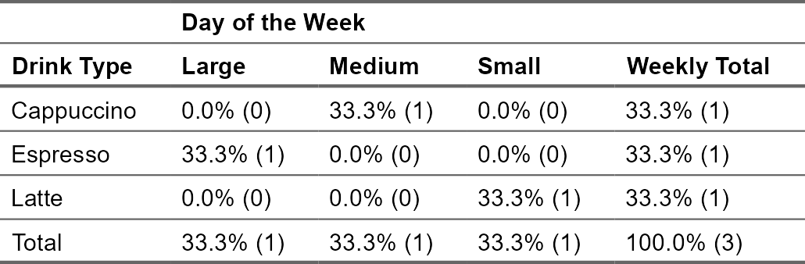

<!-- README.md is generated from README.Rmd. Please edit that file -->

# qexplore <a href="https://github.com/jarvisc1/qexplore"></a>

<!-- badges: start -->

<!-- [](https://github.com/jarvic1/qexplore/actions/workflows/R-CMD-check.yaml) -->

<!-- [](https://CRAN.R-project.org/package=qexplore) -->

<!-- badges: end -->

The goal of `qexplore` is to streamline the process of exploring and
interrogating data. It allows users to quickly list rows of a data frame
that meet certain criteria or tabulate data based on specific
conditions.

There are two functions `qlist` and `qtab` and they allow you to quickly
list or tabulate your data.

- `qlist` is tidyverse compatiable as the input and output is a
  `data.frame`.
- `qtab` is also compatible with `tidyverse` as the input is a
  `data.frame` and the output is a `tabyl`
- This also has the unintended consequence that it can be combined with
  `gt` and `flextable`.

## Installation

You can install `qexplore` from [GitHub](https://github.com/) with:

``` r
# install.packages("remotes")
remotes::install_github("jarvisc1/qexplore")
```

`qexplore` is not currently available on
[CRAN](https://cran.r-project.org/).

## Usage

Here are some examples of how to use `qexplore`. First we look at
`qlist` and then `qtab`.

The real power of these commands comes from three arguments.

- `.if`: this is like filter in dplyr, or the `df[**here**, ]` in base
  or data.table or the `if` option in `Stata` where the command would be
  written as `list var1 if var2 == 1`
- `.in`: this allows you to select the rows that you’d like to look at
  very similar to the `in` option in `Stata` or filtering by rows with
  base or `data.table`.
- `.by`: Only for `qtab` this allow for a 2x2 table to be printing
  several times by a third variable. Similar to doing a `table()` by
  three variables but I prefer this syntax as I think it’s cleaner.
  **Note:** using `.by` will result in the output being a list of
  `tabyl` so I doubt it will be compatible with `gt` or `flex.table`.

### Listing Rows

Use `qlist` to filter and explore subsets of data:

``` r
library(qexplore)

# Example dataset
data <- data.frame(
  drink_type = c("Latte", "Espresso", "Cappuccino", "Americano"),
  size = c("Small", "Large", "Medium", "Large"),
  day_of_week = c("Mon", "Tue", "Wed", "Thu")
)

# List specific rows
data |>
  qlist(drink_type, size, day_of_week, .in = 1:2)
#>  drink_type        size day_of_week 
#>           1           2           3
#> 
#> ── List Details: ───────────────────────────────────────────────────────────────
#> Columns: drink_type, size, day_of_week
#> Filter: None
#> Rows 1:2
#>   drink_type  size day_of_week
#> 1      Latte Small         Mon
#> 2   Espresso Large         Tue

# Filter and list
data |>
  qlist(drink_type, size, .if = size == "Large")
#> drink_type       size 
#>          1          2
#> 
#> ── List Details: ───────────────────────────────────────────────────────────────
#> Columns: drink_type, size
#> Filter: size == "Large"
#> Rows: All
#>   drink_type  size
#> 1   Espresso Large
#> 2  Americano Large
```

### Relation to tidyverse

`qlist` takes a dataframe as input and outputs a dataframe. Therefore it
can be connected to other tidyverse functions.

``` r
library(qexplore)
library(dplyr)
#> 
#> Attaching package: 'dplyr'
#> The following objects are masked from 'package:stats':
#> 
#>     filter, lag
#> The following objects are masked from 'package:base':
#> 
#>     intersect, setdiff, setequal, union

# Example dataset
data <- data.frame(
  drink_type = c("Latte", "Espresso", "Cappuccino", "Americano"),
  size = c("Small", "Large", "Medium", "Large"),
  day_of_week = c("Mon", "Tue", "Wed", "Thu")
)

# List specific rows
data |> 
  filter(size %in% c("Small", "Large")) |> 
  mutate(fav_drink = if_else(drink_type == "Latte", "Fav Drink", "Rubbish Drinks")) |> 
  qlist(drink_type, fav_drink, size, day_of_week, .in = 1:2) |> 
  arrange(fav_drink)
#>  drink_type   fav_drink        size day_of_week 
#>           1           4           2           3
#> 
#> ── List Details: ───────────────────────────────────────────────────────────────
#> Columns: drink_type, fav_drink, size, day_of_week
#> Filter: None
#> Rows 1:2
#>   drink_type      fav_drink  size day_of_week
#> 1      Latte      Fav Drink Small         Mon
#> 2   Espresso Rubbish Drinks Large         Tue
```

### Tabulating Data

Use `qtab` to create summary tables:

``` r
larger_data <- data.frame(
  drink_type = sample(data$drink_type, 200, replace = TRUE),
  size = sample(data$size, 200, replace = TRUE),
  day_of_week = sample(c("Mon", "Tue", "Wed", "Thu", "Fri", "Sat", "Sun"), 200, replace = TRUE),
  quantity = sample(1:5, 200, replace = TRUE),  # Add variability for quantity
  price = round(runif(200, 2.5, 6.5), 2)       # Add a random price column
)


# Tabulate a single variable
larger_data |>
  qtab(drink_type)
#> 
#> ── Table Details: ──────────────────────────────────────────────────────────────
#> Columns: drink_type
#> Filter: None
#> Rows: All
#> Group: None
#>  drink_type   n percent
#>   Americano  51   25.5%
#>  Cappuccino  54   27.0%
#>    Espresso  53   26.5%
#>       Latte  42   21.0%
#>       Total 200  100.0%

# Tabulate two variables
larger_data |>
  qtab(drink_type, size)
#> 
#> ── Table Details: ──────────────────────────────────────────────────────────────
#> Columns: drink_type, size
#> Filter: None
#> Rows: All
#> Group: None
#>  drink_type       Large     Medium      Small        Total
#>   Americano 16.5%  (33)  3.5%  (7)  5.5% (11)  25.5%  (51)
#>  Cappuccino 16.5%  (33)  5.5% (11)  5.0% (10)  27.0%  (54)
#>    Espresso 14.0%  (28)  8.5% (17)  4.0%  (8)  26.5%  (53)
#>       Latte 12.5%  (25)  4.0%  (8)  4.5%  (9)  21.0%  (42)
#>       Total 59.5% (119) 21.5% (43) 19.0% (38) 100.0% (200)

# Grouped tabulations
larger_data |> 
  filter(day_of_week %in% c("Mon", "Tues")) |> 
  qtab(drink_type, size, .by = day_of_week)
#> 
#> ── Table Details: ──────────────────────────────────────────────────────────────
#> Columns: drink_type, size
#> Filter: None
#> Rows: All
#> Group By: day_of_week
#> $Mon
#>  drink_type      Large    Medium     Small       Total
#>   Americano 23.1%  (9)  7.7% (3)  7.7% (3)  38.5% (15)
#>  Cappuccino 23.1%  (9)  0.0% (0)  5.1% (2)  28.2% (11)
#>    Espresso 12.8%  (5)  0.0% (0)  2.6% (1)  15.4%  (6)
#>       Latte  7.7%  (3)  7.7% (3)  2.6% (1)  17.9%  (7)
#>       Total 66.7% (26) 15.4% (6) 17.9% (7) 100.0% (39)
```

### Tabulating Data with different percentages

Use `qtab` with different percentages:

``` r

# Tabulate two variables
larger_data |>
  qtab(drink_type, size, per = "all")
#> 
#> ── Table Details: ──────────────────────────────────────────────────────────────
#> Columns: drink_type, size
#> Filter: None
#> Rows: All
#> Group: None
#>  drink_type       Large     Medium      Small        Total
#>   Americano 16.5%  (33)  3.5%  (7)  5.5% (11)  25.5%  (51)
#>  Cappuccino 16.5%  (33)  5.5% (11)  5.0% (10)  27.0%  (54)
#>    Espresso 14.0%  (28)  8.5% (17)  4.0%  (8)  26.5%  (53)
#>       Latte 12.5%  (25)  4.0%  (8)  4.5%  (9)  21.0%  (42)
#>       Total 59.5% (119) 21.5% (43) 19.0% (38) 100.0% (200)

# column percentages
larger_data |>
  qtab(drink_type, size, per = "col")
#> 
#> ── Table Details: ──────────────────────────────────────────────────────────────
#> Columns: drink_type, size
#> Filter: None
#> Rows: All
#> Group: None
#>  drink_type        Large      Medium       Small        Total
#>   Americano  27.7%  (33)  16.3%  (7)  28.9% (11)  25.5%  (51)
#>  Cappuccino  27.7%  (33)  25.6% (11)  26.3% (10)  27.0%  (54)
#>    Espresso  23.5%  (28)  39.5% (17)  21.1%  (8)  26.5%  (53)
#>       Latte  21.0%  (25)  18.6%  (8)  23.7%  (9)  21.0%  (42)
#>       Total 100.0% (119) 100.0% (43) 100.0% (38) 100.0% (200)

# row percentages
larger_data |>
  qtab(drink_type, size, per = "row")
#> 
#> ── Table Details: ──────────────────────────────────────────────────────────────
#> Columns: drink_type, size
#> Filter: None
#> Rows: All
#> Group: None
#>  drink_type       Large     Medium      Small        Total
#>   Americano 64.7%  (33) 13.7%  (7) 21.6% (11) 100.0%  (51)
#>  Cappuccino 61.1%  (33) 20.4% (11) 18.5% (10) 100.0%  (54)
#>    Espresso 52.8%  (28) 32.1% (17) 15.1%  (8) 100.0%  (53)
#>       Latte 59.5%  (25) 19.0%  (8) 21.4%  (9) 100.0%  (42)
#>       Total 59.5% (119) 21.5% (43) 19.0% (38) 100.0% (200)
# no percentages
larger_data |>
  qtab(drink_type, size, per = "none")
#> 
#> ── Table Details: ──────────────────────────────────────────────────────────────
#> Columns: drink_type, size
#> Filter: None
#> Rows: All
#> Group: None
#>  drink_type Large Medium Small Total
#>   Americano    33      7    11    51
#>  Cappuccino    33     11    10    54
#>    Espresso    28     17     8    53
#>       Latte    25      8     9    42
#>       Total   119     43    38   200

# Grouped tabulations
data |>
  qtab(drink_type, size, .by = day_of_week, per = "none")
#> 
#> ── Table Details: ──────────────────────────────────────────────────────────────
#> Columns: drink_type, size
#> Filter: None
#> Rows: All
#> Group By: day_of_week
#> $Mon
#>  drink_type Small Total
#>       Latte     1     1
#>       Total     1     1
#> 
#> $Tue
#>  drink_type Large Total
#>   Americano     1     1
#>       Total     1     1
#> 
#> $Wed
#>  drink_type Large Total
#>    Espresso     1     1
#>       Total     1     1
#> 
#> $Thu
#>  drink_type Medium Total
#>  Cappuccino      1     1
#>       Total      1     1
```

### Advanced Tabulations

``` r
# Tabulate with a filter condition
data |>
  qtab(drink_type, size, .if = size == "Large")
#> 
#> ── Table Details: ──────────────────────────────────────────────────────────────
#> Columns: drink_type, size
#> Filter: size == "Large"
#> Rows: All
#> Group: None
#>  drink_type      Large      Total
#>   Americano  50.0% (1)  50.0% (1)
#>    Espresso  50.0% (1)  50.0% (1)
#>       Total 100.0% (2) 100.0% (2)

# Tabulate specific rows
data |>
  qtab(drink_type, size, .in = 1:3) 
#> 
#> ── Table Details: ──────────────────────────────────────────────────────────────
#> Columns: drink_type, size
#> Filter: None
#> Rows 1:3
#> Group: None
#>  drink_type     Large    Medium     Small      Total
#>  Cappuccino  0.0% (0) 33.3% (1)  0.0% (0)  33.3% (1)
#>    Espresso 33.3% (1)  0.0% (0)  0.0% (0)  33.3% (1)
#>       Latte  0.0% (0)  0.0% (0) 33.3% (1)  33.3% (1)
#>       Total 33.3% (1) 33.3% (1) 33.3% (1) 100.0% (3)

# Group and filter tabulations
data |>
  qtab(drink_type, size, .by = day_of_week, .if = day_of_week %in% c("Mon", "Tue"))
#> 
#> ── Table Details: ──────────────────────────────────────────────────────────────
#> Columns: drink_type, size
#> Filter: day_of_week %in% c("Mon", "Tue")
#> Rows: All
#> Group By: day_of_week
#> $Mon
#>  drink_type      Small      Total
#>       Latte 100.0% (1) 100.0% (1)
#>       Total 100.0% (1) 100.0% (1)
#> 
#> $Tue
#>  drink_type      Large      Total
#>    Espresso 100.0% (1) 100.0% (1)
#>       Total 100.0% (1) 100.0% (1)
```

### Relation to tidyverse

`qtab` outputs a `tabyl` `data.frame` object. Therefore `qtab` can be
piped into anything that `tabyl` can (I think?)

``` r
library(qexplore)
library(dplyr)
library(janitor)
#> 
#> Attaching package: 'janitor'
#> The following objects are masked from 'package:stats':
#> 
#>     chisq.test, fisher.test
library(gt)
library(flextable)

# Tabulate specific rows
data |>
  qtab(drink_type, size, .in = 1:3) |> 
   adorn_title(col_name = "Drink size", row_name = "Drink Type")
#> 
#> ── Table Details: ──────────────────────────────────────────────────────────────
#> Columns: drink_type, size
#> Filter: None
#> Rows 1:3
#> Group: None
#>             Drink size                               
#>  Drink Type      Large    Medium     Small      Total
#>  Cappuccino   0.0% (0) 33.3% (1)  0.0% (0)  33.3% (1)
#>    Espresso  33.3% (1)  0.0% (0)  0.0% (0)  33.3% (1)
#>       Latte   0.0% (0)  0.0% (0) 33.3% (1)  33.3% (1)
#>       Total  33.3% (1) 33.3% (1) 33.3% (1) 100.0% (3)
```

### Relation to gt and flextable

Due to `qtab` being a `tabyl`, this has the consequence that it can be
piped into `gt` and `flextable` though this is the purpose as qexplore
is about quickly exploring data via the console. This is a nice feature
maybe this will have some unintended consequences.

``` r
library(qexplore)
library(dplyr)
library(janitor)
library(gt)

# Tabulate specific rows
gt_table <- data |>
  qtab(drink_type, size, .in = 1:3) |> 
  gt() |> 
    tab_header(
    title = "Drink Types by Day of the Week",
    subtitle = "Percentage Breakdown with Totals"
  )
#> 
#> ── Table Details: ──────────────────────────────────────────────────────────────
#> Columns: drink_type, size
#> Filter: None
#> Rows 1:3
#> Group: None
```



``` r
library(qexplore)
library(dplyr)
library(janitor)
library(flextable)

# Tabulate specific rows
tabyl_data <- data |>
  qtab(drink_type, size, .in = 1:3) 
#> 
#> ── Table Details: ──────────────────────────────────────────────────────────────
#> Columns: drink_type, size
#> Filter: None
#> Rows 1:3
#> Group: None

# Convert tabyl to flextable
flex_table <- tabyl_data |> 
  flextable() |> 
  set_header_labels(
    drink_type = "Drink Type",
    Total = "Weekly Total"
  ) |> 
  add_header_row(
    values = c("", "Day of the Week"), colwidths = c(1, ncol(tabyl_data) - 1)
  ) |> 
  theme_vanilla() |> 
  autofit()

# View the flextable
flex_table
```



<!-- ## Documentation -->

<!-- The following resources will help you get started: -->

<!-- - [Package index](https://github.com/jarvic1/qexplore/reference)   -->

<!-- Overview of all `qexplore` functions. -->

<!-- - [Getting started guide](https://github.com/jarvic1/qexplore/articles/qexplore.html)   -->

<!-- Introductory guide to using `qexplore`. -->

<!-- - [Examples](https://github.com/jarvic1/qexplore/examples)   -->

<!-- Real-world examples of data exploration with `qexplore`. -->

## Acknowledgements

This package brings together if, in, and by arguments from Stata. It
replicates something similar that you can do in `data.table`. It also
fits a tidyverse framework and uses tidyverse especially `dplyr` and
`janitor`.

I’d like to thank everyone that was involved in all of the software
above. Especially `tidyplots` for the idea that you can take something
as well established as `ggplot2` and still make something possibly
quicker and maybe more accessible that might help enable more people to
use R.

`qexplore` leverages the following amazing packages to do the heavy
lifting: cli, dplyr, rlang, tidyselect, and tidyr.
