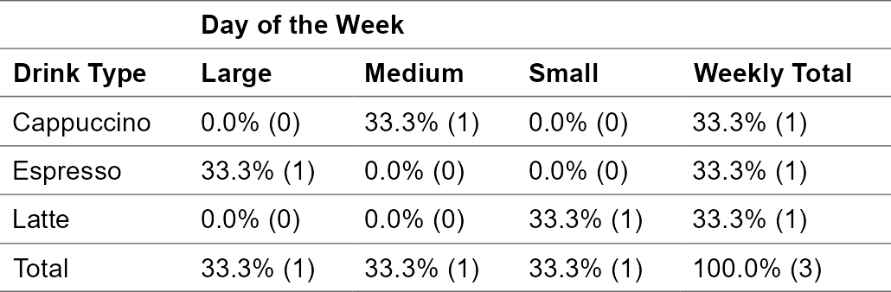

<!-- README.md is generated from README.Rmd. Please edit that file -->

# qexplore <a href="https://github.com/jarvisc1/qexplore"></a>

<!-- badges: start -->

<!-- [](https://github.com/jarvic1/qexplore/actions/workflows/R-CMD-check.yaml) -->

<!-- [](https://CRAN.R-project.org/package=qexplore) -->

<!-- badges: end -->

The goal of `qexplore` is to streamline the process of exploring and
interrogating data. It allows users to quickly list rows of a data frame
that meet certain criteria or tabulate data based on specific
conditions.

## Installation

You can install `qexplore` from [GitHub](https://github.com/) with:

``` r
# install.packages("remotes")
remotes::install_github("jarvisc1/qexplore")
```

`qexplore` is not currently available on
[CRAN](https://cran.r-project.org/).

## Usage

Here are some examples of how to use `qexplore`. There are two functions
`qlist` and `qtab` They allow you to quickly list or tabulate your data.

### Listing Rows

Use `qlist` to filter and explore subsets of data:

``` r
library(qexplore)

# Example dataset
data <- data.frame(
  drink_type = c("Latte", "Espresso", "Cappuccino", "Americano"),
  size = c("Small", "Large", "Medium", "Large"),
  day_of_week = c("Mon", "Tue", "Wed", "Thu")
)

# List specific rows
data |>
  qlist(drink_type, size, day_of_week, in_ = 1:2)
#> 
#> ── List Details: ───────────────────────────────────────────────────────────────
#> Columns: drink_type, size, day_of_week
#> Filter: None
#> Rows 1:2
#>   drink_type  size day_of_week
#> 1      Latte Small         Mon
#> 2   Espresso Large         Tue

# Filter and list
data |>
  qlist(drink_type, size, if_ = size == "Large")
#> 
#> ── List Details: ───────────────────────────────────────────────────────────────
#> Columns: drink_type, size
#> Filter: size == "Large"
#> Rows: All
#>   drink_type  size
#> 1   Espresso Large
#> 2  Americano Large
```

### Relation to tidyverse

`qlist` takes a dataframe as input and outputs a dataframe. Therefore it
can be connected to other tidyverse functions.

``` r
library(qexplore)
library(dplyr)
#> 
#> Attaching package: 'dplyr'
#> The following objects are masked from 'package:stats':
#> 
#>     filter, lag
#> The following objects are masked from 'package:base':
#> 
#>     intersect, setdiff, setequal, union

# Example dataset
data <- data.frame(
  drink_type = c("Latte", "Espresso", "Cappuccino", "Americano"),
  size = c("Small", "Large", "Medium", "Large"),
  day_of_week = c("Mon", "Tue", "Wed", "Thu")
)

# List specific rows
data |> 
  filter(size %in% c("Small", "Large")) |> 
  mutate(fav_drink = if_else(drink_type == "Latte", "Fav Drink", "Rubbish Drinks")) |> 
  qlist(drink_type, fav_drink, size, day_of_week, in_ = 1:2) |> 
  arrange(fav_drink)
#> 
#> ── List Details: ───────────────────────────────────────────────────────────────
#> Columns: drink_type, fav_drink, size, day_of_week
#> Filter: None
#> Rows 1:2
#>   drink_type      fav_drink  size day_of_week
#> 1      Latte      Fav Drink Small         Mon
#> 2   Espresso Rubbish Drinks Large         Tue
```

### Tabulating Data

Use `qtab` to create summary tables:

``` r
larger_data <- data.frame(
  drink_type = sample(data$drink_type, 200, replace = TRUE),
  size = sample(data$size, 200, replace = TRUE),
  day_of_week = sample(c("Mon", "Tue", "Wed", "Thu", "Fri", "Sat", "Sun"), 200, replace = TRUE),
  quantity = sample(1:5, 200, replace = TRUE),  # Add variability for quantity
  price = round(runif(200, 2.5, 6.5), 2)       # Add a random price column
)


# Tabulate a single variable
larger_data |>
  qtab(drink_type)
#> 
#> ── Table Details: ──────────────────────────────────────────────────────────────
#> Columns: drink_type
#> Filter: None
#> Rows: All
#> Group: None
#>  drink_type   n percent
#>   Americano  58   29.0%
#>  Cappuccino  43   21.5%
#>    Espresso  59   29.5%
#>       Latte  40   20.0%
#>       Total 200  100.0%

# Tabulate two variables
larger_data |>
  qtab(drink_type, size)
#> 
#> ── Table Details: ──────────────────────────────────────────────────────────────
#> Columns: drink_type, size
#> Filter: None
#> Rows: All
#> Group: None
#>  drink_type      Large     Medium      Small        Total
#>   Americano 13.5% (27) 10.0% (20)  5.5% (11)  29.0%  (58)
#>  Cappuccino 11.5% (23)  7.5% (15)  2.5%  (5)  21.5%  (43)
#>    Espresso 15.5% (31)  5.5% (11)  8.5% (17)  29.5%  (59)
#>       Latte  7.0% (14)  6.5% (13)  6.5% (13)  20.0%  (40)
#>       Total 47.5% (95) 29.5% (59) 23.0% (46) 100.0% (200)

# Grouped tabulations
larger_data |> 
  filter(day_of_week %in% c("Mon", "Tues")) |> 
  qtab(drink_type, size, by_ = day_of_week)
#> 
#> ── Table Details: ──────────────────────────────────────────────────────────────
#> Columns: drink_type, size
#> Filter: None
#> Rows: All
#> Group By: day_of_week
#> $Mon
#>  drink_type      Large    Medium     Small       Total
#>   Americano 17.9%  (5) 14.3% (4)  3.6% (1)  35.7% (10)
#>  Cappuccino 14.3%  (4) 10.7% (3)  3.6% (1)  28.6%  (8)
#>    Espresso  7.1%  (2)  0.0% (0)  7.1% (2)  14.3%  (4)
#>       Latte  7.1%  (2)  0.0% (0) 14.3% (4)  21.4%  (6)
#>       Total 46.4% (13) 25.0% (7) 28.6% (8) 100.0% (28)
```

### Tabulating Data with different percentages

Use `qtab` with different percentages:

``` r

# Tabulate two variables
larger_data |>
  qtab(drink_type, size, per = "all")
#> 
#> ── Table Details: ──────────────────────────────────────────────────────────────
#> Columns: drink_type, size
#> Filter: None
#> Rows: All
#> Group: None
#>  drink_type      Large     Medium      Small        Total
#>   Americano 13.5% (27) 10.0% (20)  5.5% (11)  29.0%  (58)
#>  Cappuccino 11.5% (23)  7.5% (15)  2.5%  (5)  21.5%  (43)
#>    Espresso 15.5% (31)  5.5% (11)  8.5% (17)  29.5%  (59)
#>       Latte  7.0% (14)  6.5% (13)  6.5% (13)  20.0%  (40)
#>       Total 47.5% (95) 29.5% (59) 23.0% (46) 100.0% (200)

# column percentages
larger_data |>
  qtab(drink_type, size, per = "col")
#> 
#> ── Table Details: ──────────────────────────────────────────────────────────────
#> Columns: drink_type, size
#> Filter: None
#> Rows: All
#> Group: None
#>  drink_type       Large      Medium       Small        Total
#>   Americano  28.4% (27)  33.9% (20)  23.9% (11)  29.0%  (58)
#>  Cappuccino  24.2% (23)  25.4% (15)  10.9%  (5)  21.5%  (43)
#>    Espresso  32.6% (31)  18.6% (11)  37.0% (17)  29.5%  (59)
#>       Latte  14.7% (14)  22.0% (13)  28.3% (13)  20.0%  (40)
#>       Total 100.0% (95) 100.0% (59) 100.0% (46) 100.0% (200)

# row percentages
larger_data |>
  qtab(drink_type, size, per = "row")
#> 
#> ── Table Details: ──────────────────────────────────────────────────────────────
#> Columns: drink_type, size
#> Filter: None
#> Rows: All
#> Group: None
#>  drink_type      Large     Medium      Small        Total
#>   Americano 46.6% (27) 34.5% (20) 19.0% (11) 100.0%  (58)
#>  Cappuccino 53.5% (23) 34.9% (15) 11.6%  (5) 100.0%  (43)
#>    Espresso 52.5% (31) 18.6% (11) 28.8% (17) 100.0%  (59)
#>       Latte 35.0% (14) 32.5% (13) 32.5% (13) 100.0%  (40)
#>       Total 47.5% (95) 29.5% (59) 23.0% (46) 100.0% (200)
# no percentages
larger_data |>
  qtab(drink_type, size, per = "none")
#> 
#> ── Table Details: ──────────────────────────────────────────────────────────────
#> Columns: drink_type, size
#> Filter: None
#> Rows: All
#> Group: None
#>  drink_type Large Medium Small Total
#>   Americano    27     20    11    58
#>  Cappuccino    23     15     5    43
#>    Espresso    31     11    17    59
#>       Latte    14     13    13    40
#>       Total    95     59    46   200

# Grouped tabulations
data |>
  qtab(drink_type, size, by_ = day_of_week, per = "none")
#> 
#> ── Table Details: ──────────────────────────────────────────────────────────────
#> Columns: drink_type, size
#> Filter: None
#> Rows: All
#> Group By: day_of_week
#> $Mon
#>  drink_type Small Total
#>       Latte     1     1
#>       Total     1     1
#> 
#> $Tue
#>  drink_type Large Total
#>   Americano     1     1
#>       Total     1     1
#> 
#> $Wed
#>  drink_type Large Total
#>    Espresso     1     1
#>       Total     1     1
#> 
#> $Thu
#>  drink_type Medium Total
#>  Cappuccino      1     1
#>       Total      1     1
```

### Advanced Tabulations

``` r
# Tabulate with a filter condition
data |>
  qtab(drink_type, size, if_ = size == "Large")
#> 
#> ── Table Details: ──────────────────────────────────────────────────────────────
#> Columns: drink_type, size
#> Filter: size == "Large"
#> Rows: All
#> Group: None
#>  drink_type      Large      Total
#>   Americano  50.0% (1)  50.0% (1)
#>    Espresso  50.0% (1)  50.0% (1)
#>       Total 100.0% (2) 100.0% (2)

# Tabulate specific rows
data |>
  qtab(drink_type, size, in_ = 1:3) 
#> 
#> ── Table Details: ──────────────────────────────────────────────────────────────
#> Columns: drink_type, size
#> Filter: None
#> Rows 1:3
#> Group: None
#>  drink_type     Large    Medium     Small      Total
#>  Cappuccino  0.0% (0) 33.3% (1)  0.0% (0)  33.3% (1)
#>    Espresso 33.3% (1)  0.0% (0)  0.0% (0)  33.3% (1)
#>       Latte  0.0% (0)  0.0% (0) 33.3% (1)  33.3% (1)
#>       Total 33.3% (1) 33.3% (1) 33.3% (1) 100.0% (3)

# Group and filter tabulations
data |>
  qtab(drink_type, size, by_ = day_of_week, if_ = day_of_week %in% c("Mon", "Tue"))
#> 
#> ── Table Details: ──────────────────────────────────────────────────────────────
#> Columns: drink_type, size
#> Filter: day_of_week %in% c("Mon", "Tue")
#> Rows: All
#> Group By: day_of_week
#> $Mon
#>  drink_type      Small      Total
#>       Latte 100.0% (1) 100.0% (1)
#>       Total 100.0% (1) 100.0% (1)
#> 
#> $Tue
#>  drink_type      Large      Total
#>    Espresso 100.0% (1) 100.0% (1)
#>       Total 100.0% (1) 100.0% (1)
```

### Relation to tidyverse

`qtab` outputs a `tabyl` `data.frame` object. Therefore `qtab` can be
piped into anything that `tabyl` can (I think?)

``` r
library(qexplore)
library(dplyr)
library(janitor)
#> Warning: package 'janitor' was built under R version 4.3.3
#> 
#> Attaching package: 'janitor'
#> The following objects are masked from 'package:stats':
#> 
#>     chisq.test, fisher.test
library(gt)
library(flextable)

# Tabulate specific rows
data |>
  qtab(drink_type, size, in_ = 1:3) |> 
   adorn_title(col_name = "Drink size", row_name = "Drink Type")
#> 
#> ── Table Details: ──────────────────────────────────────────────────────────────
#> Columns: drink_type, size
#> Filter: None
#> Rows 1:3
#> Group: None
#>             Drink size                               
#>  Drink Type      Large    Medium     Small      Total
#>  Cappuccino   0.0% (0) 33.3% (1)  0.0% (0)  33.3% (1)
#>    Espresso  33.3% (1)  0.0% (0)  0.0% (0)  33.3% (1)
#>       Latte   0.0% (0)  0.0% (0) 33.3% (1)  33.3% (1)
#>       Total  33.3% (1) 33.3% (1) 33.3% (1) 100.0% (3)
```

### Relation to gt and flextable

Due to `qtab` being a `tabyl`, this has the consequence that it can be
piped into `gt` and `flextable` though this is the purpose as qexplore
is about quickly exploring data via the console. This is a nice feature
maybe this will have some unintended consequences.

``` r
library(qexplore)
library(dplyr)
library(janitor)
library(gt)
library(flextable)

# Tabulate specific rows
data |>
  qtab(drink_type, size, in_ = 1:3) |> 
  gt() |> 
    tab_header(
    title = "Drink Types by Day of the Week",
    subtitle = "Percentage Breakdown with Totals"
  )
#> 
#> ── Table Details: ──────────────────────────────────────────────────────────────
#> Columns: drink_type, size
#> Filter: None
#> Rows 1:3
#> Group: None
```

<div id="rlujkeduhr" style="padding-left:0px;padding-right:0px;padding-top:10px;padding-bottom:10px;overflow-x:auto;overflow-y:auto;width:auto;height:auto;">
<style>#rlujkeduhr table {
  font-family: system-ui, 'Segoe UI', Roboto, Helvetica, Arial, sans-serif, 'Apple Color Emoji', 'Segoe UI Emoji', 'Segoe UI Symbol', 'Noto Color Emoji';
  -webkit-font-smoothing: antialiased;
  -moz-osx-font-smoothing: grayscale;
}
&#10;#rlujkeduhr thead, #rlujkeduhr tbody, #rlujkeduhr tfoot, #rlujkeduhr tr, #rlujkeduhr td, #rlujkeduhr th {
  border-style: none;
}
&#10;#rlujkeduhr p {
  margin: 0;
  padding: 0;
}
&#10;#rlujkeduhr .gt_table {
  display: table;
  border-collapse: collapse;
  line-height: normal;
  margin-left: auto;
  margin-right: auto;
  color: #333333;
  font-size: 16px;
  font-weight: normal;
  font-style: normal;
  background-color: #FFFFFF;
  width: auto;
  border-top-style: solid;
  border-top-width: 2px;
  border-top-color: #A8A8A8;
  border-right-style: none;
  border-right-width: 2px;
  border-right-color: #D3D3D3;
  border-bottom-style: solid;
  border-bottom-width: 2px;
  border-bottom-color: #A8A8A8;
  border-left-style: none;
  border-left-width: 2px;
  border-left-color: #D3D3D3;
}
&#10;#rlujkeduhr .gt_caption {
  padding-top: 4px;
  padding-bottom: 4px;
}
&#10;#rlujkeduhr .gt_title {
  color: #333333;
  font-size: 125%;
  font-weight: initial;
  padding-top: 4px;
  padding-bottom: 4px;
  padding-left: 5px;
  padding-right: 5px;
  border-bottom-color: #FFFFFF;
  border-bottom-width: 0;
}
&#10;#rlujkeduhr .gt_subtitle {
  color: #333333;
  font-size: 85%;
  font-weight: initial;
  padding-top: 3px;
  padding-bottom: 5px;
  padding-left: 5px;
  padding-right: 5px;
  border-top-color: #FFFFFF;
  border-top-width: 0;
}
&#10;#rlujkeduhr .gt_heading {
  background-color: #FFFFFF;
  text-align: center;
  border-bottom-color: #FFFFFF;
  border-left-style: none;
  border-left-width: 1px;
  border-left-color: #D3D3D3;
  border-right-style: none;
  border-right-width: 1px;
  border-right-color: #D3D3D3;
}
&#10;#rlujkeduhr .gt_bottom_border {
  border-bottom-style: solid;
  border-bottom-width: 2px;
  border-bottom-color: #D3D3D3;
}
&#10;#rlujkeduhr .gt_col_headings {
  border-top-style: solid;
  border-top-width: 2px;
  border-top-color: #D3D3D3;
  border-bottom-style: solid;
  border-bottom-width: 2px;
  border-bottom-color: #D3D3D3;
  border-left-style: none;
  border-left-width: 1px;
  border-left-color: #D3D3D3;
  border-right-style: none;
  border-right-width: 1px;
  border-right-color: #D3D3D3;
}
&#10;#rlujkeduhr .gt_col_heading {
  color: #333333;
  background-color: #FFFFFF;
  font-size: 100%;
  font-weight: normal;
  text-transform: inherit;
  border-left-style: none;
  border-left-width: 1px;
  border-left-color: #D3D3D3;
  border-right-style: none;
  border-right-width: 1px;
  border-right-color: #D3D3D3;
  vertical-align: bottom;
  padding-top: 5px;
  padding-bottom: 6px;
  padding-left: 5px;
  padding-right: 5px;
  overflow-x: hidden;
}
&#10;#rlujkeduhr .gt_column_spanner_outer {
  color: #333333;
  background-color: #FFFFFF;
  font-size: 100%;
  font-weight: normal;
  text-transform: inherit;
  padding-top: 0;
  padding-bottom: 0;
  padding-left: 4px;
  padding-right: 4px;
}
&#10;#rlujkeduhr .gt_column_spanner_outer:first-child {
  padding-left: 0;
}
&#10;#rlujkeduhr .gt_column_spanner_outer:last-child {
  padding-right: 0;
}
&#10;#rlujkeduhr .gt_column_spanner {
  border-bottom-style: solid;
  border-bottom-width: 2px;
  border-bottom-color: #D3D3D3;
  vertical-align: bottom;
  padding-top: 5px;
  padding-bottom: 5px;
  overflow-x: hidden;
  display: inline-block;
  width: 100%;
}
&#10;#rlujkeduhr .gt_spanner_row {
  border-bottom-style: hidden;
}
&#10;#rlujkeduhr .gt_group_heading {
  padding-top: 8px;
  padding-bottom: 8px;
  padding-left: 5px;
  padding-right: 5px;
  color: #333333;
  background-color: #FFFFFF;
  font-size: 100%;
  font-weight: initial;
  text-transform: inherit;
  border-top-style: solid;
  border-top-width: 2px;
  border-top-color: #D3D3D3;
  border-bottom-style: solid;
  border-bottom-width: 2px;
  border-bottom-color: #D3D3D3;
  border-left-style: none;
  border-left-width: 1px;
  border-left-color: #D3D3D3;
  border-right-style: none;
  border-right-width: 1px;
  border-right-color: #D3D3D3;
  vertical-align: middle;
  text-align: left;
}
&#10;#rlujkeduhr .gt_empty_group_heading {
  padding: 0.5px;
  color: #333333;
  background-color: #FFFFFF;
  font-size: 100%;
  font-weight: initial;
  border-top-style: solid;
  border-top-width: 2px;
  border-top-color: #D3D3D3;
  border-bottom-style: solid;
  border-bottom-width: 2px;
  border-bottom-color: #D3D3D3;
  vertical-align: middle;
}
&#10;#rlujkeduhr .gt_from_md > :first-child {
  margin-top: 0;
}
&#10;#rlujkeduhr .gt_from_md > :last-child {
  margin-bottom: 0;
}
&#10;#rlujkeduhr .gt_row {
  padding-top: 8px;
  padding-bottom: 8px;
  padding-left: 5px;
  padding-right: 5px;
  margin: 10px;
  border-top-style: solid;
  border-top-width: 1px;
  border-top-color: #D3D3D3;
  border-left-style: none;
  border-left-width: 1px;
  border-left-color: #D3D3D3;
  border-right-style: none;
  border-right-width: 1px;
  border-right-color: #D3D3D3;
  vertical-align: middle;
  overflow-x: hidden;
}
&#10;#rlujkeduhr .gt_stub {
  color: #333333;
  background-color: #FFFFFF;
  font-size: 100%;
  font-weight: initial;
  text-transform: inherit;
  border-right-style: solid;
  border-right-width: 2px;
  border-right-color: #D3D3D3;
  padding-left: 5px;
  padding-right: 5px;
}
&#10;#rlujkeduhr .gt_stub_row_group {
  color: #333333;
  background-color: #FFFFFF;
  font-size: 100%;
  font-weight: initial;
  text-transform: inherit;
  border-right-style: solid;
  border-right-width: 2px;
  border-right-color: #D3D3D3;
  padding-left: 5px;
  padding-right: 5px;
  vertical-align: top;
}
&#10;#rlujkeduhr .gt_row_group_first td {
  border-top-width: 2px;
}
&#10;#rlujkeduhr .gt_row_group_first th {
  border-top-width: 2px;
}
&#10;#rlujkeduhr .gt_summary_row {
  color: #333333;
  background-color: #FFFFFF;
  text-transform: inherit;
  padding-top: 8px;
  padding-bottom: 8px;
  padding-left: 5px;
  padding-right: 5px;
}
&#10;#rlujkeduhr .gt_first_summary_row {
  border-top-style: solid;
  border-top-color: #D3D3D3;
}
&#10;#rlujkeduhr .gt_first_summary_row.thick {
  border-top-width: 2px;
}
&#10;#rlujkeduhr .gt_last_summary_row {
  padding-top: 8px;
  padding-bottom: 8px;
  padding-left: 5px;
  padding-right: 5px;
  border-bottom-style: solid;
  border-bottom-width: 2px;
  border-bottom-color: #D3D3D3;
}
&#10;#rlujkeduhr .gt_grand_summary_row {
  color: #333333;
  background-color: #FFFFFF;
  text-transform: inherit;
  padding-top: 8px;
  padding-bottom: 8px;
  padding-left: 5px;
  padding-right: 5px;
}
&#10;#rlujkeduhr .gt_first_grand_summary_row {
  padding-top: 8px;
  padding-bottom: 8px;
  padding-left: 5px;
  padding-right: 5px;
  border-top-style: double;
  border-top-width: 6px;
  border-top-color: #D3D3D3;
}
&#10;#rlujkeduhr .gt_last_grand_summary_row_top {
  padding-top: 8px;
  padding-bottom: 8px;
  padding-left: 5px;
  padding-right: 5px;
  border-bottom-style: double;
  border-bottom-width: 6px;
  border-bottom-color: #D3D3D3;
}
&#10;#rlujkeduhr .gt_striped {
  background-color: rgba(128, 128, 128, 0.05);
}
&#10;#rlujkeduhr .gt_table_body {
  border-top-style: solid;
  border-top-width: 2px;
  border-top-color: #D3D3D3;
  border-bottom-style: solid;
  border-bottom-width: 2px;
  border-bottom-color: #D3D3D3;
}
&#10;#rlujkeduhr .gt_footnotes {
  color: #333333;
  background-color: #FFFFFF;
  border-bottom-style: none;
  border-bottom-width: 2px;
  border-bottom-color: #D3D3D3;
  border-left-style: none;
  border-left-width: 2px;
  border-left-color: #D3D3D3;
  border-right-style: none;
  border-right-width: 2px;
  border-right-color: #D3D3D3;
}
&#10;#rlujkeduhr .gt_footnote {
  margin: 0px;
  font-size: 90%;
  padding-top: 4px;
  padding-bottom: 4px;
  padding-left: 5px;
  padding-right: 5px;
}
&#10;#rlujkeduhr .gt_sourcenotes {
  color: #333333;
  background-color: #FFFFFF;
  border-bottom-style: none;
  border-bottom-width: 2px;
  border-bottom-color: #D3D3D3;
  border-left-style: none;
  border-left-width: 2px;
  border-left-color: #D3D3D3;
  border-right-style: none;
  border-right-width: 2px;
  border-right-color: #D3D3D3;
}
&#10;#rlujkeduhr .gt_sourcenote {
  font-size: 90%;
  padding-top: 4px;
  padding-bottom: 4px;
  padding-left: 5px;
  padding-right: 5px;
}
&#10;#rlujkeduhr .gt_left {
  text-align: left;
}
&#10;#rlujkeduhr .gt_center {
  text-align: center;
}
&#10;#rlujkeduhr .gt_right {
  text-align: right;
  font-variant-numeric: tabular-nums;
}
&#10;#rlujkeduhr .gt_font_normal {
  font-weight: normal;
}
&#10;#rlujkeduhr .gt_font_bold {
  font-weight: bold;
}
&#10;#rlujkeduhr .gt_font_italic {
  font-style: italic;
}
&#10;#rlujkeduhr .gt_super {
  font-size: 65%;
}
&#10;#rlujkeduhr .gt_footnote_marks {
  font-size: 75%;
  vertical-align: 0.4em;
  position: initial;
}
&#10;#rlujkeduhr .gt_asterisk {
  font-size: 100%;
  vertical-align: 0;
}
&#10;#rlujkeduhr .gt_indent_1 {
  text-indent: 5px;
}
&#10;#rlujkeduhr .gt_indent_2 {
  text-indent: 10px;
}
&#10;#rlujkeduhr .gt_indent_3 {
  text-indent: 15px;
}
&#10;#rlujkeduhr .gt_indent_4 {
  text-indent: 20px;
}
&#10;#rlujkeduhr .gt_indent_5 {
  text-indent: 25px;
}
</style>
<table class="gt_table" data-quarto-disable-processing="false" data-quarto-bootstrap="false">
  <thead>
    <tr class="gt_heading">
      <td colspan="5" class="gt_heading gt_title gt_font_normal" style>Drink Types by Day of the Week</td>
    </tr>
    <tr class="gt_heading">
      <td colspan="5" class="gt_heading gt_subtitle gt_font_normal gt_bottom_border" style>Percentage Breakdown with Totals</td>
    </tr>
    <tr class="gt_col_headings">
      <th class="gt_col_heading gt_columns_bottom_border gt_left" rowspan="1" colspan="1" scope="col" id="drink_type">drink_type</th>
      <th class="gt_col_heading gt_columns_bottom_border gt_right" rowspan="1" colspan="1" scope="col" id="Large">Large</th>
      <th class="gt_col_heading gt_columns_bottom_border gt_right" rowspan="1" colspan="1" scope="col" id="Medium">Medium</th>
      <th class="gt_col_heading gt_columns_bottom_border gt_right" rowspan="1" colspan="1" scope="col" id="Small">Small</th>
      <th class="gt_col_heading gt_columns_bottom_border gt_right" rowspan="1" colspan="1" scope="col" id="Total">Total</th>
    </tr>
  </thead>
  <tbody class="gt_table_body">
    <tr><td headers="drink_type" class="gt_row gt_left">Cappuccino</td>
<td headers="Large" class="gt_row gt_right">0.0% (0)</td>
<td headers="Medium" class="gt_row gt_right">33.3% (1)</td>
<td headers="Small" class="gt_row gt_right">0.0% (0)</td>
<td headers="Total" class="gt_row gt_right">33.3% (1)</td></tr>
    <tr><td headers="drink_type" class="gt_row gt_left">Espresso</td>
<td headers="Large" class="gt_row gt_right">33.3% (1)</td>
<td headers="Medium" class="gt_row gt_right">0.0% (0)</td>
<td headers="Small" class="gt_row gt_right">0.0% (0)</td>
<td headers="Total" class="gt_row gt_right">33.3% (1)</td></tr>
    <tr><td headers="drink_type" class="gt_row gt_left">Latte</td>
<td headers="Large" class="gt_row gt_right">0.0% (0)</td>
<td headers="Medium" class="gt_row gt_right">0.0% (0)</td>
<td headers="Small" class="gt_row gt_right">33.3% (1)</td>
<td headers="Total" class="gt_row gt_right">33.3% (1)</td></tr>
    <tr><td headers="drink_type" class="gt_row gt_left">Total</td>
<td headers="Large" class="gt_row gt_right">33.3% (1)</td>
<td headers="Medium" class="gt_row gt_right">33.3% (1)</td>
<td headers="Small" class="gt_row gt_right">33.3% (1)</td>
<td headers="Total" class="gt_row gt_right">100.0% (3)</td></tr>
  </tbody>
  &#10;  
</table>
</div>

``` r
library(qexplore)
library(dplyr)
library(janitor)
library(gt)
library(flextable)

# Tabulate specific rows
tabyl_data <- data |>
  qtab(drink_type, size, in_ = 1:3) 
#> 
#> ── Table Details: ──────────────────────────────────────────────────────────────
#> Columns: drink_type, size
#> Filter: None
#> Rows 1:3
#> Group: None

# Convert tabyl to flextable
flex_table <- tabyl_data |> 
  flextable() |> 
  set_header_labels(
    drink_type = "Drink Type",
    Total = "Weekly Total"
  ) |> 
  add_header_row(
    values = c("", "Day of the Week"), colwidths = c(1, ncol(tabyl_data) - 1)
  ) |> 
  theme_vanilla() |> 
  autofit()

# View the flextable
flex_table
```



<!-- ## Documentation -->

<!-- The following resources will help you get started: -->

<!-- - [Package index](https://github.com/jarvic1/qexplore/reference)   -->

<!-- Overview of all `qexplore` functions. -->

<!-- - [Getting started guide](https://github.com/jarvic1/qexplore/articles/qexplore.html)   -->

<!-- Introductory guide to using `qexplore`. -->

<!-- - [Examples](https://github.com/jarvic1/qexplore/examples)   -->

<!-- Real-world examples of data exploration with `qexplore`. -->

## Acknowledgements

This package brings together if, in, and by arguments from Stata. It
replicates something similar that you can do in `data.table`. It also
fits a tidyverse framework and uses tidyverse especially `dplyr` and
`janitor`.

I’d like to thank everyone that was involved in all of the software
above. Especially `tidyplots` for the idea that you can take something
as well established as `ggplot2` and still make something possibly
quicker and maybe more accessible that might help enable more people to
use R.

`qexplore` leverages the following amazing packages to do the heavy
lifting: cli, dplyr, rlang, tidyselect, and tidyr.
